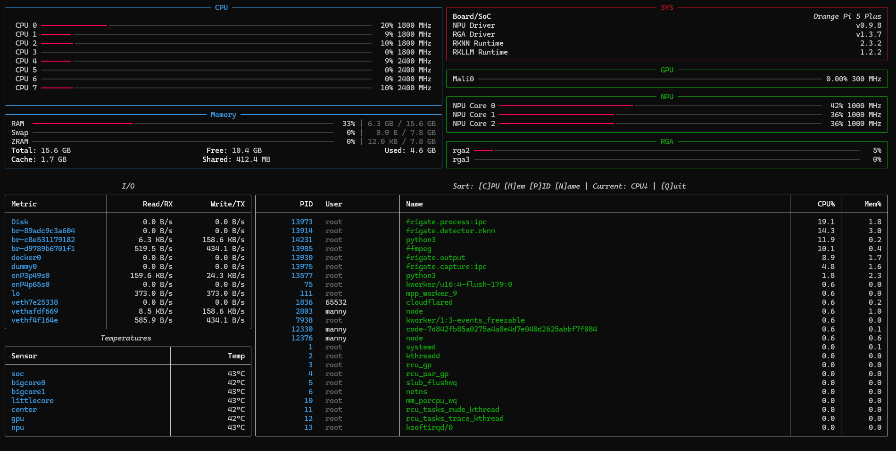

# 🖥️ yarktop - Yet Another Rockchip `top`-like Tool

**yarktop** is a feature-rich, real-time system monitor for Rockchip SoC boards (RK3588, RK3399, etc.), providing comprehensive monitoring of CPU, GPU, NPU, RGA, memory, temperatures, I/O, network traffic, and running processes.

## **✨ Features**

- **Real-time CPU monitoring** - Per-core usage and frequency
- **GPU (Mali) monitoring** - Usage percentage and frequency
- **NPU monitoring** - Multi-core load and frequency tracking
- **RGA monitoring** - Graphics accelerator load per scheduler
- **Memory tracking** - RAM, Swap, and ZRAM usage with cache/shared details
- **Thermal monitoring** - All available temperature sensors
- **I/O statistics** - Real-time disk read/write and network RX/TX rates
- **Process viewer** - Top 16 processes by CPU usage
- **System information** - SoC model, driver versions (NPU, RGA, RKNN, RKLLM)
- **Interactive UI** - Built with Rich library for beautiful terminal graphics


## **🎨 Screenshot**



---

## **📥 Installation**

### **Prerequisites**

Required Python packages:
```bash
sudo pip3 install rich psutil
```

### **Quick Install**

1. **Download the script:**
   ```bash
   wget https://raw.githubusercontent.com/emapco/yarktop/main/yarktop
   ```

2. **Make it executable:**
   ```bash
   chmod +x yarktop
   ```

3. **Optional: Install system-wide:**
   ```bash
   sudo cp yarktop /usr/local/bin/yarktop
   sudo chmod +x /usr/local/bin/yarktop
   ```


## **🚀 Usage**

**Root permissions are required** to access hardware monitoring interfaces:

```bash
sudo ./yarktop
```

Or if installed system-wide:
```bash
sudo yarktop
```

### **Controls**

- **`q`** or **`Q`** or **`ESC`** - Exit the application
- **`c`** or **`C`** - Sort processes by CPU usage (toggle ascending/descending)
- **`m`** or **`M`** - Sort processes by memory usage (toggle ascending/descending)
- **`p`** or **`P`** - Sort processes by PID (toggle ascending/descending)
- **`n`** or **`N`** - Sort processes by name (toggle ascending/descending)

## **🔧 Supported Hardware**

yarktop works on Rockchip SoC boards including:

- **RK3588/RK3588S** (Orange Pi 5, Rock 5, Khadas Edge 2, etc.)
- Other Rockchip boards with appropriate kernel support

**Note:** Some features (GPU, NPU, RGA) require specific kernel drivers and debugfs access.

For detailed setup instructions, see the [Rockchip Environment Setup](https://github.com/emapco/yarktop/wiki/Rockchip-Environment-Setup) wiki page.


## **📋 Requirements**

- **Python 3.9+**
- **Root access** (required for hardware monitoring)
- **Kernel support** for:
  - Mali GPU (`/sys/kernel/debug/mali0/`)
  - NPU (`/sys/kernel/debug/rknpu/`)
  - RGA (`/sys/kernel/debug/rkrga/`)
  - Temperature sensors
  - CPU frequency scaling

## **📝 License**

This program is free software: you can redistribute it and/or modify it under the terms of the GNU General Public License v3.0 as published by the Free Software Foundation.
